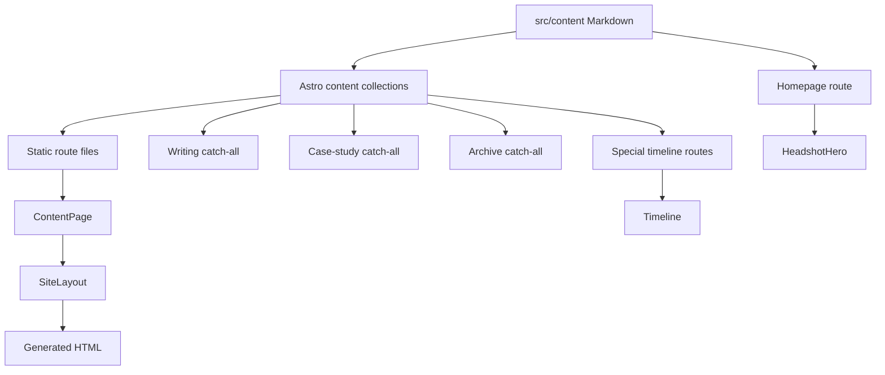
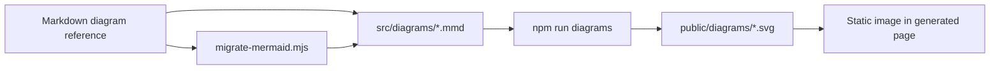

# Kiefer Waight - Astro site

Markdown-driven personal site built with Astro content collections. The repository separates authored content, route composition, reusable presentation, and generated diagram assets.

## Quick start

```sh
npm install
npm run dev
```

The development server is available at `http://localhost:4321/` by default.

## Commands

| Command | Purpose |
| --- | --- |
| `npm install` | Install Astro, Mermaid, TypeScript, and related dependencies. |
| `npm run dev` | Start the Astro development server. |
| `npm run check` | Run Astro type, content, and component diagnostics. |
| `npm run diagrams` | Compile every `src/diagrams/*.mmd` source into a static SVG in `public/diagrams/`. |
| `npm run images:dry-run` | List R2 originals that will receive responsive WebP variants. |
| `npm run images:upload` | Generate `480`, `768`, `960`, and `1440`px WebP variants in R2, without upscaling, and verify each public URL. |
| `npm run install-hooks` | Configure this clone to run the repository's pre-push checks. |
| `npm run build` | Regenerate diagrams, then build the static site into `dist/`. |
| `npm run test:unit` | Run Vitest utility tests for image URLs and content relationships. |
| `npm run test:quality` | Run Astro checks, unit tests, production artifact validation, and live R2 image checks. |
| `npm run preview` | Serve the production build locally. |

`npm run build` runs `npm run diagrams` first through the `prebuild` hook. Run `npm run check` after content or component changes; run `npm run build` before publishing.

## Image storage

Content images are delivered from `https://images.kieferwaight.com`, backed by Cloudflare R2. Every JPEG, PNG, or WebP original gets WebP variants named `<filename>-w480.webp`, `<filename>-w768.webp`, `<filename>-w960.webp`, and `<filename>-w1440.webp`. Responsive components and Markdown images derive those URLs directly from the original URL, so no per-image configuration is required. Browsers choose the smallest adequate candidate, then fall back to the original when WebP is unavailable. Browser icons remain in `public/assets/img/` so the manifest and favicon paths stay on the main origin.

Set these values in the shell environment (not in Git): `R2_BUCKET`, `AWS_ACCESS_KEY_ID`, and `AWS_SECRET_ACCESS_KEY`. `R2_ENDPOINT` is optional; the upload script derives the account endpoint when it is absent. Run `npm run images:dry-run` to inspect R2 source objects, then `npm run images:upload` to generate and verify variants whenever you add or replace an original. GitHub Pages builds only the site artifact; it does not require R2 write credentials.

Run `npm run install-hooks` once after cloning. The pre-push hook runs `npm run images:upload` and blocks the push if R2 variants cannot be generated and verified. Upload new original images to R2 before pushing content that references them.

## Source organization

```text
src/
├── content.config.ts              Collection loaders and schemas
├── content/                       Authored Markdown and timeline data
│   ├── pages/                     Homepage, advisory, and resume
│   ├── writing/                   Essays and the writing index
│   ├── case-studies/              Case-study hubs and deep dives
│   ├── archive/                   Historical records and source editions
│   ├── projects/                  Projects index
│   ├── research/                  Research briefs
│   └── timeline/                  Timeline entries consumed by archive pages
├── diagrams/                      Editable Mermaid sources (.mmd)
├── components/                    Reusable Astro presentation components
├── layouts/                       Shared document shell and site metadata
├── pages/                         URL routes and route-specific composition
└── styles/                        Global design tokens and responsive CSS

public/
└── diagrams/                      Generated Mermaid SVGs, not authored by hand

scripts/
├── build-diagrams.mjs             Mermaid-to-SVG build utility
├── migrate-mermaid.mjs            Markdown diagram migration utility
└── puppeteer.config.json          Mermaid renderer configuration
```

## Content collections

Collection files are the source of truth for page copy, metadata, and structured historical data. Collection schemas are defined in `src/content.config.ts`.

| Collection | Responsibility | Route behavior |
| --- | --- | --- |
| `pages` | `home.md`, `advisory.md`, and `resume.md` | Fixed routes: `/`, `/advisory/`, and `/resume/`. |
| `writing` | Essays plus `index.md` | `/writing/` is the index; individual essays use `/writing/<slug>/`. |
| `case-studies` | Case-study index, UTA, and Industrial Telemetry content | `/case-studies/` is the index; a catch-all route handles individual and nested entries. |
| `archive` | Historical source records plus the archive index | `/archive/` is the index; individual records use `/archive/<slug>/`. |
| `projects` | Projects index | Fixed route: `/projects/`. |
| `research` | Telemetry research brief | Fixed route: `/research/telemetry/`. |
| `timeline` | GetMyBoat milestone data | No direct routes; rendered by the GetMyBoat timeline page. |
| `studio-timeline` | AppealingStudio milestone data | No direct routes; rendered by the AppealingStudio archive page. |

The general collections use a shared metadata shape including `title`, descriptions, dates, canonical URLs, Open Graph fields, author data, and schema type. Timeline collections use a stricter shape with `title`, `date`, `summary`, optional source metadata, `tags`, and `featured`.

## Route patterns



Most pages follow this path:

1. A Markdown entry is loaded from a named collection.
2. A route passes the entry to `ContentPage.astro`.
3. `ContentPage` renders the entry and adds the shared page header, metadata, and article footer.
4. `SiteLayout.astro` supplies the document shell, navigation, theme initialization, SEO tags, and global scripts.

### Intentional route exceptions

- `src/pages/index.astro` composes the homepage manually because it has a full-width hero, optimized `HeadshotHero`, and proof links.
- `src/pages/archive/getmyboat-timeline/index.astro` combines an archive entry with the `timeline` collection and `Timeline.astro`.
- `src/pages/archive/appealingstudio/index.astro` combines the AppealingStudio archive entry with the `studio-timeline` collection and `Timeline.astro`.
- `src/pages/getmyboat-timeline.html.astro` preserves a legacy URL and redirects it to `/archive/getmyboat-timeline/`.

The catch-all archive route still exists for ordinary records. Explicit timeline routes take precedence over it; Astro reports that precedence as a build warning, but the generated specialized routes are correct.

## Component responsibilities

| Component | Responsibility |
| --- | --- |
| `SiteLayout.astro` | HTML document shell, canonical URL, Open Graph metadata, fonts, navigation, theme setup, footer, and code-block enhancement. |
| `ContentPage.astro` | Shared collection-entry header and article rendering, including section-specific classes and shared article footer wiring. |
| `ArticleFooter.astro` | Related writing, related case studies, and context-aware return navigation for writing, case-study, and archive pages. |
| `ArchiveSourcePanel.astro` | Provenance panel built from archive entry metadata such as original URL and Wayback capture. |
| `Timeline.astro` | Newest-first timeline rendering with dates, tags, featured milestones, and evidence links. |
| `HeadshotHero.astro` | Homepage-only optimized headshot rendered with Astro's `Image` component. |
| `CodeBlocks.astro` | Adds language labels and copy behavior to Shiki-rendered code blocks. |
| `ThemeToggle.astro` | Light/dark theme control. |
| `MobileMenu.astro` | Small-screen navigation toggle. |

Shared content behavior belongs in components or the layout. Route files should remain responsible for selecting entries and composing specialized page sections; authored prose belongs in `src/content/`.

## Diagram pipeline

Mermaid sources are editable files in `src/diagrams/`. The build utility invokes `mmdc` with the shared Puppeteer configuration and writes matching SVGs to `public/diagrams/`.



Use this workflow when changing a diagram:

```sh
# Edit an existing .mmd source, then regenerate all SVGs.
npm run diagrams

# Check the site and build the final static output.
npm run check
npm run build
```

Generated SVGs are build artifacts. Edit the `.mmd` source, not the generated file. Content references generated diagrams as ordinary images, so there is no client-side Mermaid rendering delay.

## Content and route conventions

- Use Markdown for authored prose and frontmatter for page metadata.
- Use collection entries for data that needs sorting or structured rendering, such as timelines.
- Use `ContentPage.astro` for standard collection pages.
- Add an explicit route only when a page needs specialized composition or a legacy redirect.
- Keep archive provenance in frontmatter so `ArchiveSourcePanel.astro` can render it consistently.
- Keep related navigation in shared footer components rather than duplicating utility rows inside articles.
- Use descriptive internal links and preserve external source links on the relevant archive record.
- Keep diagram source names aligned with the content path and generate the corresponding SVG through `npm run diagrams`.

## Validation checklist

Before publishing a change:

```sh
npm run check
npm run build
```

Then inspect the affected route in both light and dark themes, check narrow-screen wrapping, confirm internal links resolve, and verify that any new diagram has meaningful alt text and a caption where context is needed.
